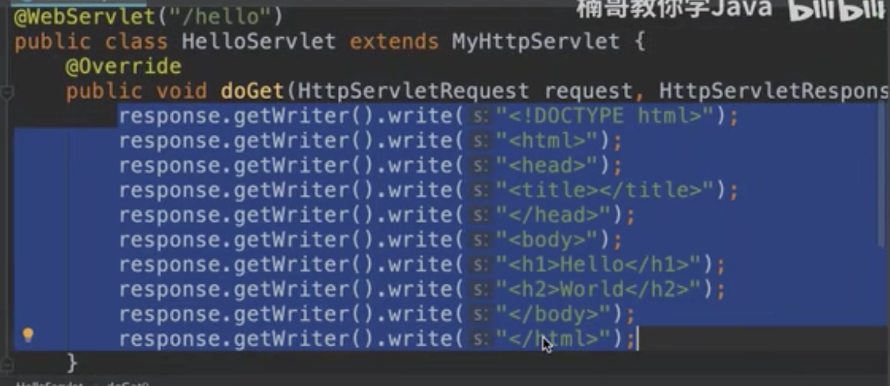
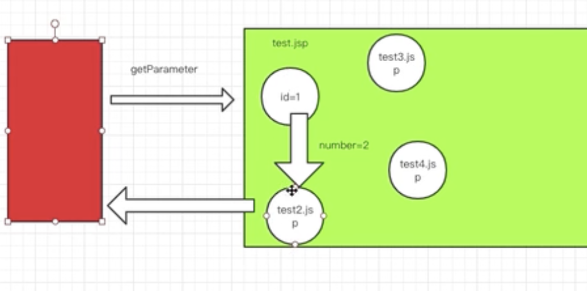
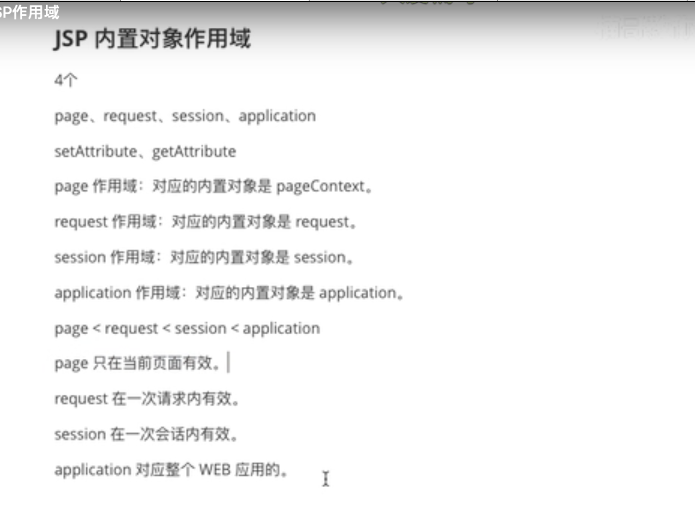

# JSP
<br></br>

+ JSP本质上就是一个Servlet，把各种混合文件自动转换成Servlet
  <br></br>

+ JSP主要负责与用户交互，将最终界面呈现给用户
  <br></br>

+ HTML+JS+CSS+Java的混合文件，页面+数据
  <br></br>


---
<br></br>

##### 如果用Servlet中的doGET()去返回页面会非常麻烦


<br></br>

---

<br></br>

+ JSP相当于可以把HTML自动生成Servlet, 而且可以加入Java代码。
  <br></br>
+ 当服务器接收到jsp请求的时候，交给JSP引擎处理，每一个jsp页面第一次被访问时，引擎翻译成Servlet文件，再用Web容器调用Servlet完成响应。

<br></br>

##### 单纯从开发角度，JSP就是html中嵌入java。

<br></br>

---

### 3种嵌入方式：

<br></br>

##### 1. JSP脚本
```jsp
<% Java代码 %>
```
注意这里java代码不会被写入servlet呈现

<br></br>

##### 2. JSP声明
```jsp
<%!
    声明方法
%>
```

<br></br>

##### 3. JSP表达式，java对象直接输出到页面
```jsp
<%=Java变量%>
```
<br></br>

##### 【样例1】
```jsp
<% String str = test(); %>

<%!
    public String test() {
        return "hello";
    }
%>

<%=str%>
```
<br></br>

##### 【样例2】
```jsp
<%@ page import="java.util.List" %>
<%@ page import="java.util.ArrayList" %>
<%@ page contentType="text/html; charset=UTF-8" pageEncoding="UTF-8" %>
<!DOCTYPE html>
<html>
<head>
    <title>JSP - Hello World</title>
</head>
<body>
<h1>Index</h1>
<br/>
<%
    List<String> names = new ArrayList<>();
    names.add("A");
    names.add("B");
    names.add("C");

    List<Integer> ages = new ArrayList<>();
    ages.add(22);
    ages.add(21);
    ages.add(23);
%>
<table>
    <tr>
        <th>姓名</th>
        <th>年龄</th>
    </tr>

    <%
        //java部分是无视html，连续的
        for (int i = 0; i < 3; i++) {
    %>

    <tr>
        <td><%=names.get(i)%></td>
        <td><%=ages.get(i)%></td>
    </tr>

    <%
        }
    %>

</table>

</body>
</html>
```

<br></br>

---

### 九个JSP内置对象

<br></br>

>1. __request__:表示一次请求 HttpSevletRequest
>2. __response__：表示一次响应 HttpSevletResponse
>3. __pageContext__：页面上下文，获取页面信息，PageContext
>4. __session__：表示一次会话,保存用户信息，HttpSession
>5. __application__：表示当前web应用，全局对象，保存所有用户共享信息，ServletContext
>6. __config__：表示当前JSP对应的Servlet的ServletConfig对象，获取当前Servlet的信息，ServletConfig
>7. __out__：向浏览器输出数据，JspWriter
>8. __page__：当前JSP对应的Servlet对象，Servlet
>9. __exception__：表示JSP页面发生的异常，Exception

<br></br>

__常用的是request，response，session，application，pageContext__

<br></br>

---

### request常用方法

<br></br>

---

1. #### String getParameter(String key) 根据key获取客户端发来请求的参数
  
<br></br>

URL: localhost:8080/hello?id=9&name=a&age=20

<br></br>

##### java中用request

```java
String idStr = request.getParameter("id");
//强转
Integer id = Integer.parseInt(idStr);
System.out.println(id);
```
<br></br>


##### jsp中用request

```jsp
    <%
        String id = request.getParameter("id");
    %>
    <%=id%>

```
<br></br>

这里可以直接用request对象是因为Servlet的service方法的参数中已经传进来request对象了，
jsp会自动把代码转给servlet的service方法，当然可以用request对象

<br></br>

---

2. #### void setAttribute(String key, Object value) 通过键值对的形式保存数据
  

3. #### Object getAttribute(String key) 通过key取出value
  
<br></br>


<br></br>

getParameter是用于客户端发来的请求中的参数
而get/setAttribute是服务器中数值的存放，把数据存入request中，方便jsp文件间的数据读写

<br></br>

##### test1.jsp
```jsp
<%@ page contentType="text/html;charset=UTF-8" language="java" %>
<html>
<head>
    <title>test1</title>
</head>
<body>
    <%
        String idStr = request.getParameter("id");
        Integer id = Integer.parseInt(idStr);
        id++;

        //把数据存入到request中
        request.setAttribute("ID", id);

        //把请求转发给test2.jsp
        request.getRequestDispatcher("test2.jsp").forward(request, response);
    %>
</body>
</html>
```
<br></br>


##### test2.jsp
```jsp
<%@ page contentType="text/html;charset=UTF-8" language="java" %>
<html>
<head>
    <title>test2</title>
</head>
<body>
    <%
        //拿过来是Object类型，转型
        Integer id = (Integer) request.getAttribute("ID");
    %>
    <%=id%>


</body>
</html>
```

<br></br>

---

4. #### RequestDispatcher getRequestDispatcher (String path)该对象的forward方法用于请求转发

<br></br>

---

5. #### String[] getParameterValues() 获取客户端请求传来的多个重名参数

<br></br>

localhost:8080/test.jsp?name=a&name=b&name=c
```jsp
    <%
        String[] names = request.getParameterValues("name");

    %>
    <%=Arrays.toString(names)%>
```
<br></br>

---

6. #### void setCharacterEncoding(String charset);
```jsp
    <%
        request.setCharacterEncoding("UTF-8");

    %>
```

<br></br>

---

### HTTP请求状态码

<br></br>

>__200__:正常
>__404__:资源找不到
>__400__:请求类型不匹配
>__500__:java程序有问题

---

### response常用方法：

<br></br>

#### 1. sendRedirect(String path)重定向，页面间的跳转

<br></br>

转发getREquestDispatcher和重定向sendRedirect的区别：
转发是把同一个请求传给下一个页面，重定向是创建一个新的请求传给下一个页面，之前的请求结束生命周期
所以导致不能getAttribute

<br></br>

__转发__：同一个请求在服务器之间传递，地址栏不变，也叫服务器跳转
__重定向__：由客户端发送一次新的请求来访问跳转后的目标资源，地址栏改变，也叫做客户端跳转

<br></br>
如果两个页面之间要传值，必须用转发不能用重定向

##### 用户登录
如果登陆成功，转发用户信息到首页
如果登陆失败，重定向到登陆页面

<br></br>

##### login.jsp

```jsp
<%@ page contentType="text/html;charset=UTF-8" language="java" %>
<html>
<head>
    <title>Title</title>
</head>
<body>
  <form action="/check.jsp" method="post">
      用户名： <input type="text" name="username"/><br/>
      密码： <input type="password" name="password"/><br/>
      <input type="submit" value="登陆"/>
  </form>

</body>
</html>
```

<br></br>

##### check.jsp

```jsp
<%@ page contentType="text/html;charset=UTF-8" language="java" %>
<html>
<head>
    <title>Title</title>
</head>
<body>
  <%
    String username = request.getParameter("username");
    String password = request.getParameter("password");
    if (username.equals("admin") && password.equals("123456")){

        //登陆成功
        request.setAttribute("username", username);
        request.getRequestDispatcher("welcome.jsp").forward(request, response);

    } else {

        //登陆失败
        response.sendRedirect("login.jsp");

    }

  %>
</body>
</html>
```

<br></br>

##### welcome.jsp

```jsp
<%@ page contentType="text/html;charset=UTF-8" language="java" %>
<html>
<head>
    <title>Title</title>
</head>
<body>
    <%
        String name = (String) request.getAttribute("username");

    %>
    欢迎回来<p>name</p>

</body>
</html>
```
---

### session

<br/>

服务器无法识别请求出处，不知道来自哪个终端，只会受到一个请求信号
必须有一种技术让服务器知道请求来源

<br/>

__会话__：就是客户端和服务器之间发生的一系列连续的请求和响应的过程。
也就是打开浏览器到关闭浏览器的过程

__会话状态__：指服务器和浏览器在会话过程中产生的状态信息，借助会话状态，
服务器能够把属于同一次会话的一系列请求和响应关联起来
<br/>

##### 实现会话有两种方式

>1. session【服务端】
>2. cookie【客户端】
<br/>

属于同一次会话的请求都有一个相同的标识符，sessionID

#### session常用的方法：

> + String getId() 获取sessionID
> <br/>
> + void setMaxInactiveInterval(int interval) 设置session放入失效时间，单位为秒
比如七天内登陆免登陆
<br/>
> + int getMaxInactiveInterval() 获取session的失效时间
> <br/>
> + void invalidate() 设置session立即失效
比如立即退出登陆

#### CRUD

> + void setAttribute(String key, Object vlaue) 通过键值对的形式来存数据/改
<br/>
> + Object getAttribute(String key) 获取
<br/>
> + void removeAttribute(String key) 删除
<br/>

上面那个check.jsp是纯java代码，没必要用jsp写了再转servlet

#### 如果要完全写到servlet里面：
<br/>

##### login.jsp
```jsp
<%@ page contentType="text/html;charset=UTF-8" language="java" %>
<html>
<head>
    <title>Title</title>
</head>
<body>
  <form action="/login" method="post">
      <table>
          <tr>
              <td>
                  用户名：
              </td>
              <td>
                  <input type="text" name="username"/><br/>
              </td>
          </tr>
          <tr>
              <td>
                  密码：
              </td>
              <td>
                  <input type="password" name="password"/><br/>
              </td>

          </tr>
          <tr>
              <td>
                  <input type="submit" value="登陆"/>
              </td>
              <td>
                  <input type="reset" value="重置"/>
              </td>
          </tr>
      </table>

  </form>

</body>
</html>
```
<br/>

##### web.xml
```xml
<?xml version="1.0" encoding="UTF-8"?>
<web-app xmlns="http://xmlns.jcp.org/xml/ns/javaee"
         xmlns:xsi="http://www.w3.org/2001/XMLSchema-instance"
         xsi:schemaLocation="http://xmlns.jcp.org/xml/ns/javaee http://xmlns.jcp.org/xml/ns/javaee/web-app_4_0.xsd"
         version="4.0">

        <servlet>
            <servlet-name>LoginServlet</servlet-name>
            <servlet-class>com.example.servlet.LoginServlet</servlet-class>
            <init-param>
                <param-name>username</param-name>
                <param-value>admin</param-value>
            </init-param>
            <init-param>
                <param-name>password</param-name>
                <param-value>123456</param-value>
            </init-param>
        </servlet>

        <servlet-mapping>
            <servlet-name>LoginServlet</servlet-name>
            <url-pattern>/login</url-pattern>
        </servlet-mapping>


</web-app>
```
<br/>

##### LoginServlet.java
```java
package com.example.servlet;

import javax.servlet.ServletConfig;
import javax.servlet.ServletException;
import javax.servlet.http.HttpServlet;
import javax.servlet.http.HttpServletRequest;
import javax.servlet.http.HttpServletResponse;
import java.io.IOException;


public class LoginServlet extends HttpServlet {

    //为了跨方法用这两个变量，定义成全局变量

    private String myusername;
    private String mypassword;

    @Override
    public void init(ServletConfig config) throws ServletException {
        //这里不用this.myusername是因为init（）参数里面没有myusername
        //若传参有，就近原则会用传参的，所以要用this区分，this.myusername特指子类的全局变量

        //这两个变量是从config里面读取的初始化参数，就是正确的账号和密码
       myusername = config.getInitParameter("username");
       mypassword = config.getInitParameter("password");
    }

    @Override
    protected void doGet(HttpServletRequest req, HttpServletResponse resp) throws ServletException, IOException {
        super.doGet(req, resp);
    }

    @Override
    protected void doPost(HttpServletRequest req, HttpServletResponse resp) throws ServletException, IOException {

        //从登陆页面读取的用户输入的账号和密码
        String username = req.getParameter("username");
        String password = req.getParameter("password ");

        if (username.equals(myusername) && password.equals(mypassword)) {
            req.setAttribute("username", username);
            req.getRequestDispatcher("welcome.jsp").forward(req, resp);
        }else {
            resp.sendRedirect("login.jsp");
        }
    }
}

```
<br/>

##### 用session延长request生命周期
```java
HttpSession session = req.getSession();
session.setAttribute("username", username);
```
<br/>

---

<br/>

##### welcome.jsp

<br/>

```jsp
<a href="/logout">退出登陆</a>
```
<br/>

##### LogoutServlet

<br/>

```java
package com.example.servlet;

import javax.servlet.ServletException;
import javax.servlet.annotation.WebServlet;
import javax.servlet.http.HttpServlet;
import javax.servlet.http.HttpServletRequest;
import javax.servlet.http.HttpServletResponse;
import javax.servlet.http.HttpSession;
import java.io.IOException;

@WebServlet("/logout")
public class LogoutServlet extends HttpServlet {
    @Override
    protected void doGet(HttpServletRequest req, HttpServletResponse resp) throws ServletException, IOException {
        HttpSession session = req.getSession();
        session.invalidate();
        resp.sendRedirect("login.jsp");
    }
}

```

<br/>

---

### Cookie

cookie在浏览器存储，服务端在http响应中附带传给浏览器的一个小文本文件
一旦浏览器保存了某个cookie。在之后的请求和响应过程中，
会将此cookie来回传递，这样就可以通过cookie这个载体
完成客户端和服务器之间的传递

</br>

---

##### 创建cookie，响应到客户端

</br>


```jsp
<%
    Cookie cookie = new Cookie("name", "cat");
    response.addCookie(cookie);
%>
```
</br>

---

##### 读取cookie

</br>

```jsp
<%
    Cookie[] cookies = request.getCookies();
    for(Cookie cookie:cookies) {
        out.write(cookie.toString() + ": "+cookie.getValue() + "</br>");
    }
%>
```
</br>

cookie一关浏览器就无了
但是可以设置时间延长生命周期。session不行，一关浏览器就无。

</br>

---

#### cookie常用的方法

</br>

>+ void setMaxAge(int age) 单位为秒
>+ int getMaxAge() 有效时间
>+ String getName()
>+ String getValue()

</br>

---

#### session和cookie的区别

</br>

##### session：
>+ 保存在服务器
>+ Object
>+ 会话结束销毁
>+ 保存重要信息（密码）

</br>

##### cookie：
>+ 保存在浏览器
>+ String
>+ 长期存在浏览器中，与会话无关
>+ 保存不重要信息（视频看到哪里了）

</br>

---

##### cookie版的用户登陆

</br>

##### cookielogin.jsp

```jsp
<%@ page contentType="text/html;charset=UTF-8" language="java" %>
<html>
<head>
    <title>Title</title>
</head>
<body>
    <form action="/cookieLogin" method="post">
        <table>
            <tr>
                <td>
                    用户名：
                </td>
                <td>
                    <input type="text" name="username"/><br/>
                </td>
            </tr>
            <tr>
                <td>
                    密码：
                </td>
                <td>
                    <input type="password" name="password"/><br/>
                </td>

            </tr>
            <tr>
                <td>
                    <input type="submit" value="登陆"/>
                </td>
                <td>
                    <input type="reset" value="重置"/>
                </td>
            </tr>
        </table>

    </form>

</body>
</html>

```
</br>

##### CookieLoginServlet.java

```java
package com.example.servlet;

import javax.servlet.ServletException;
import javax.servlet.annotation.WebServlet;
import javax.servlet.http.Cookie;
import javax.servlet.http.HttpServlet;
import javax.servlet.http.HttpServletRequest;
import javax.servlet.http.HttpServletResponse;
import java.io.IOException;

@WebServlet("/cookieLogin")
public class CookieLoginServlet extends HttpServlet {

    private String myusername = "admin";
    private String mypassword = "123456";

    @Override
    protected void doGet(HttpServletRequest req, HttpServletResponse resp) throws ServletException, IOException {
        super.doGet(req, resp);
    }

    @Override
    protected void doPost(HttpServletRequest req, HttpServletResponse resp) throws ServletException, IOException {
        String username = req.getParameter("username");
        String password = req.getParameter("password");

        if(username.equals(myusername) && password.equals(mypassword)) {
            Cookie cookie = new Cookie("name", username);

            //7天免登录，存到电脑本地
            cookie.setMaxAge(60*60*24*7);
            resp.addCookie(cookie);
            resp.sendRedirect("cookiewelcome.jsp");
        }else {
            resp.sendRedirect("cookielogin.jsp");

        }
    }
}

```
</br>

##### cookiewelcome.jsp

```jsp
<%@ page contentType="text/html;charset=UTF-8" language="java" %>
<html>
<head>
    <title>Title</title>
</head>
<body>
    <%
        Cookie[] cookies = request.getCookies();
        for(Cookie cookie:cookies) {
            if (cookie.getName().equals("name")) {
                out.write(cookie.toString() + ": " + cookie.getValue() + "</br>");
            }
        }
    %>
    <a href="/cookieLogout">退出</a>

</body>
</html>

```
</br>

##### CookieLogoutServlet.java
```java
package com.example.servlet;

import javax.servlet.ServletException;
import javax.servlet.annotation.WebServlet;
import javax.servlet.http.Cookie;
import javax.servlet.http.HttpServlet;
import javax.servlet.http.HttpServletRequest;
import javax.servlet.http.HttpServletResponse;
import java.io.IOException;

@WebServlet("/cookieLogout")
public class CookieLogoutServlet extends HttpServlet {
    @Override
    protected void doGet(HttpServletRequest req, HttpServletResponse resp) throws ServletException, IOException {

        //先把cookie找出来，再销毁
        Cookie[] cookies = req.getCookies();
        for(Cookie cookie:cookies) {
            if (cookie.getName().equals("name")) {
                cookie.setMaxAge(0);

                //只要修改了cookie，必须add进resp
                resp.addCookie(cookie);
                resp.sendRedirect("cookielogin.jsp");
            }
        }


    }
}
```
</br>

---

</br>

---

##### 存储用户信息：

</br>

#### Session:

</br>

setAttribute("name", "admin") 存
getAttribute("name")  取

__生命周期__：只要服务端web应用重启就销毁，只要客户端浏览器关闭就销毁
__退出登录__：session.invalidate()

</br>

#### Cookie：
response.addCookie(new Cookie(name, "admin")) 存
取的时候要先把cookie根据key找出来

</br>

```java
        Cookie[] cookies = request.getCookies();
        for(Cookie cookie:cookies) {
            if (cookie.getName().equals("name")) {
                out.write(cookie.toString() + ": " + cookie.getValue() + "</br>");
            }
        }
```
</br>

__生命周期__：不随服务器重启销毁，客户端默认是关闭浏览器就销毁，
但是可以通过setMaxAge（）来延长生命周期，可以设置时间，不随关闭浏览器就销毁
</br>

__退出登陆__：setMaxAge(0)

---

### JSP内部对象作用域

</br>



</br>

#### 网站访问量统计

```java
<%@ page contentType="text/html;charset=UTF-8" language="java" %>
<html>
<head>
    <title>Title</title>
</head>
<body>
    <%
        Integer count = (Integer) application.getAttribute("count");
        if (count == null) {
            count = 1;
            application.setAttribute("count");
        }else{
            count++;
            application.setAttribute("count");
        }
    %>
    您是当前的第<%=count%>位访客

</body>
</html>

```

</br>

---

### EL 表达式


</br>

Expression Language表达式语言
代替JSP页面中数据访问时的复杂代码
可以非常便捷的取出域对象（pageContext, request, session, application）中保存的数据
前提是一定要先setAttribute

</br>

##### EL就相当于简化getAttribute
</br>


${变量名}变量名就是setAttribute对应的key值

</br>

##### EL对于4个域对象的默认查找顺序：

</br>

pageContext ->request->session->application
找到立即返回，application找不到就返回null

</br>

##### 指定作用域进行查找

</br>

```
${__Scope.name} 如${pageScope.name}来获取指定的域
```

</br>

#### EL表达式样例

</br>

##### User.java

```java
package com.example;

public class User {

    private String name;
    private int id;
    private int score;

    public String getName() {
        return name;
    }

    public void setName(String name) {
        this.name = name;
    }

    public int getId() {
        return id;
    }

    public void setId(int id) {
        this.id = id;
    }

    public int getScore() {
        return score;
    }

    public void setScore(int score) {
        this.score = score;
    }

    public User(int id, String name, int score) {
        this.name = name;
        this.id = id;
        this.score = score;
    }

    @Override
    public String toString() {
        return "User{" +
                "name='" + name + '\'' +
                ", id=" + id +
                ", score=" + score +
                '}';
    }
}

```

</br>

##### el2.jsp

```java
<%@ page contentType="text/html;charset=UTF-8" language="java" %>
<html>
<head>
    <title>Title</title>
</head>
<body>
    <%
        //String name = (String)request.getAttribute("name");
        User user = new User(1,"A",86);
        pageContext.setAttribute("user", user);
    %>

    <hr/>
    <table>
        <tr>
            <th>编号</th>
            <th>姓名</th>
            <th>成绩</th>
        </tr>
        <%
            //EL表达式只能在jsp文件中写，
            //jsp会把el表达式转换成(（User）pageContext.getAttribute("user")).getId();
            //这里是调getId方法，不是调属性
            //也可以写${user["id"]}
        %>
        <tr>
            <td>${user.id}</td>
            <td>${user.name}</td>
            <td>${user.score}</td>
        </tr>
    </table>


</body>
</html>

```

</br>

#### EL执行表达式
</br>
&& || ! == 返回布尔值 and也可以

```
== eq
!= ne
< lt
> gt
<= le
>= ge
empty (null/length=0/size=0)判断
比如判断num是否为空
${not empty num}
```
</br>

---

### JSTL

</br>
JSP Standard Tag Library JSP标准标签库，
JSP为开发者提供的一系列的标签，使用这些标签可
以完成一些逻辑处理，比如循环遍历集合，让代码更
加简洁，不再出现JSP脚本穿插的情况

</br>
实际开发中，JSTL侧重于逻辑处理,EL数据展示处理

</br>

##### JSTL的使用

</br>

1. 导入jar包（jstl.jar standard.jar）到lib文件夹，lib文件夹必须放在WEB-INF目录下
2. project structure里面libraries中按加号添加两个jar
3. 在JSP页面引入JSTL

</br>

```java
<%@ taglib prefix="c" uri="http://java.sun.com/jsp/jstl/core"%>
```
需要的地方就可以用“c”来调用JSTL

</br>

```jsp

    <%
        List<User> list = (List<User>) request.getAttribute();
        for(User user1:list) {
            request.setAttribute("user", user1);
    %>
        <tr>
            <td>${user1.id}</td>
            <td>${user1.name}</td>
            <td>${user1.score}</td>
        </tr>
    <%
        }
    %>

    上面这段用JSTL可以写成：
    
    <c:forEach items="${list}" var="user">
        <tr>
            <td>${user.id}</td>
            <td>${user1.name}</td>
            <td>${user1.score}</td>
        </tr>
    </c:forEach>

```

</br>

##### JSTL的优点：
</br>

1.提供统一的标签
2.可以用于编写各种动态功能

</br>

##### 核心常用标签：
</br>

set，out，remove，catch

</br>

##### set 向内部对象添加数据
</br>

可以用scope选择存储作用域

</br>


```jsp
<%
    request.setAttribute(key, value)
%>

<c:set var="name" value="tom" scope="request"></c:set>
${requestScope.name}

<%
    User user = new User(1,"A", 50);
    request.setAttribute("user", user);
%>

${user.name}
<c:set target="${user}" property="name" value="B"></c:set>
${user.name}
```

</br>

##### out 可以输出域对象中的数据
</br>

```jsp
<c:out var="name" value="tom"></c:out>
<c:out value="${name}" default="未定义"></c:out>
```

##### remove 删除域对象的数据
</br>
```jsp
<c:remove var="name" scope="page"></c:remove>
<c:out value="${name}" default="未定义"></c:out>
```
</br>

##### catch 捕获异常信息，页面展示

</br>

```jsp
<c:catch var="error">
    <%
        int a  = 10/0;
    %>

</c:catch>
${error}

```

</br>

#### 条件标签

3:25代码

#### 迭代标签

10:05代码

---

#### 格式化标签库fmt，要引入

17:25

#### 函数标签库，要引入

24:10

---

### 综合例子【user的增删改查】


28:00 add


servlet 36:07 37:57另一种方法

delete 40:15

update 55:12


