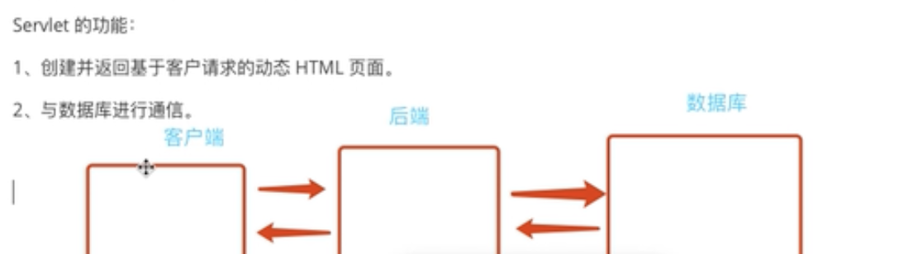

# Servlet

<br></br>

+ ### 什么是Servlet？
  
  <br></br>
  
  >+ __Servlet__ 是 __Java web开发的基石__ ，是与 __平台无关__ 的 __服务器组件__
  >+ 运行在 __Servlet容器/Web应用服务器/Tomcat__
  >+ 负责与 __客户端__ 和 __数据库__ 进行 __通信__

  <br></br>

  ##### Servlet的功能：
    >1. 创建并返回基于客户请求的动态HTML页面
    >2. 与客户端和数据库进行通信

    <br></br>



  <br></br>

---
  <br></br>

+ ### 如何使用Servlet？
  + Servlet本身是一组接口（ *描述功能，在javax.servlet包里面* ）
    自定义一个类，并且实现Servlet接口。功能：
    + 接受客户端请求
    + 根据请求做出响应
  
+ ### 【样例】
    
    + 新建一个class叫MyServlet
    
    <br></br>

    ```java
        package com.example.servlet;

        import javax.servlet.*;
        import java.io.IOException;

        public class MyServlet implements Servlet {

            @Override
            public void init(ServletConfig servletConfig) throws ServletException {

            }

            @Override
            public ServletConfig getServletConfig() {
                return null;
            }

            @Override
            public void service(ServletRequest servletRequest, ServletResponse servletResponse) throws ServletException, IOException {

                String id = servletRequest.getParameter("id");
                System.out.println("我是服务端，已经获取到客户端请求,参数是" + id);

                servletResponse.setContentType("text/html;charset=UTF-8");
                servletResponse.getWriter().write("hello client" + id);

            }

            @Override
            public String getServletInfo() {
                return null;
            }

            @Override
            public void destroy() {

            }
        }

    ```
    <br></br>

        浏览器无法直接访问Servlet文件夹，只能通过映射间接访问。

    #### 方法一：web.xml中添加映射

    <br></br>

    ```xml
                <servlet>
                    <servlet-name>MyServlet</servlet-name>
                    <servlet-class>com.example.servlet.MyServlet</servlet-class>
                </servlet>

                <servlet-mapping>
                    <servlet-name>MyServlet</servlet-name>
                    <url-pattern>/myservlet</url-pattern>
                </servlet-mapping>
    ```

    <br></br>

    ##### 【输出结果】

    <br></br>

    

    <br></br>

    ---

    #### 方法二：注解

    <br></br>

    ```java
        @WebServlet("/demo1")
        public class MyServlet implements Servlet {

        }
    ```
    <br></br>
    上述两种配置方式完全一致，在浏览器地址中访问/demo1就直接映射到MyServlet

    <br></br>

---

+ ### Servlet生命周期
  
  <br></br>

>+ __init()__ ：当浏览器访问Servlet的时候，Tomcat会查询当前实例化对象是否存在，
    若不存在，Tomcat通过反射机制调无参构造，init完成初始化操作（一次）（单例模式）
>+ __service()__ : 之后每次都是进行业务逻辑操作，不再初始化（n次）
>+ __destroy()__ : 关闭后释放占用资源（一次）

<br></br>

---


+ ### ServletConfig
  
  <br></br>

```java
public interface ServletConfig {

    String getServletName();

    ServletContext getServletContext();

    String getInitParameter(String var1);

    Enumeration<String> getInitParameterNames();
}

```

__该接口描述Servlet基本信息__

<br></br>

+ #### getServletName() 返回Servlet名字

+ #### getInitParameter(String var1) 通过key索引，返回init参数的值（web.xml）

web.xml中：

```xml
        <servlet>
            <servlet-name>MyServlet</servlet-name>
            <servlet-class>com.example.servlet.MyServlet</servlet-class>
            <init-param>
                <param-name>username</param-name>
                <param-value>admin</param-value>
            </init-param>
        </servlet>
```
MyServlet.java中

```java
    @Override
    public void init(ServletConfig servletConfig) throws ServletException {
        System.out.println(getServletConfig().getInitParameter("username"));
    }
```

+ #### getInitParameterNames() 返回所有Servlet名字,enumeration形式
web.xml中：
```xml
        <servlet>
            <servlet-name>MyServlet</servlet-name>
            <servlet-class>com.example.servlet.MyServlet</servlet-class>
            <init-param>
                <param-name>username</param-name>
                <param-value>user</param-value>
            </init-param>
            <init-param>
                <param-name>password</param-name>
                <param-value>123456</param-value>
            </init-param>
            <init-param>
                <param-name>type</param-name>
                <param-value>admin</param-value>
            </init-param>
        </servlet>
```
MyServlet.java中
```java
    @Override
    public void init(ServletConfig servletConfig) throws ServletException {
        Enumeration<String> enumeration = servletConfig.getInitParameterNames();
        while (enumeration.hasMoreElements()) {
            String  element = enumeration.nextElement();
            System.out.println(servletConfig.getInitParameter(element));
        }
    }
```

+ #### getServletContext() 返回ServletContext对象，是Servlet的上下文，整个Servlet的管理者

ServletContext是接口


