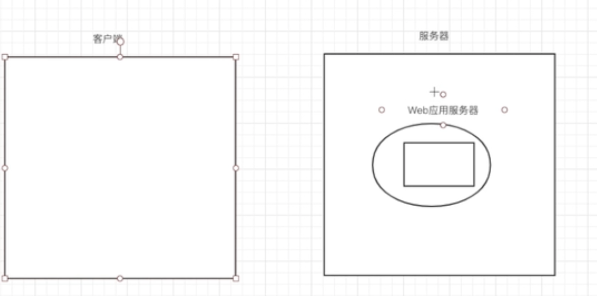

```
```
# Tomcat
---

+ ### Web应用服务器：
    __Tomcat__、 Jboos、 Weblogic、Jetty




---

+ ### 安装Tomcat
    + #### 官网下载对应平台压缩文件
    + #### 解压缩
        > - __bin__: 存放在各平台下启动和停止Tomcat服务的脚本文件
        > - __backup__: 之前用过会有，不然没有这个文件
        > - __conf__: 存放各种Tomcat服务器配置文件 eg.port8080
        >- __lib__: Tomcat服务需要的jar包
        >- __logs__: 存放Tomcat服务运行的日志
        >- __temp__: Tomcat运行时的临时文件
        >- __webapps__: 存放允许客户端访问的资源（Java程序）
        >- __work__: 存放JSP转换后的Servlet文件


---
+ ### IDEA集成Tomcat
    + ##### 创建Java Enterprise项目，勾选Web Application
    + ##### 打开Run/Debug configurations(在右上角绿色锤子右边) 
      >+ 点加号->Tomcat Server-Local
      >+ 加入Tomcat，选择本地路径
      >+ Deployment加入工程
    + ##### 可以运行


---

+ ### URL
  >+ IP:Port/Application Name/
  >+ Application context可以Run/Debug configurations-Deployment修改URL中的Application Name

