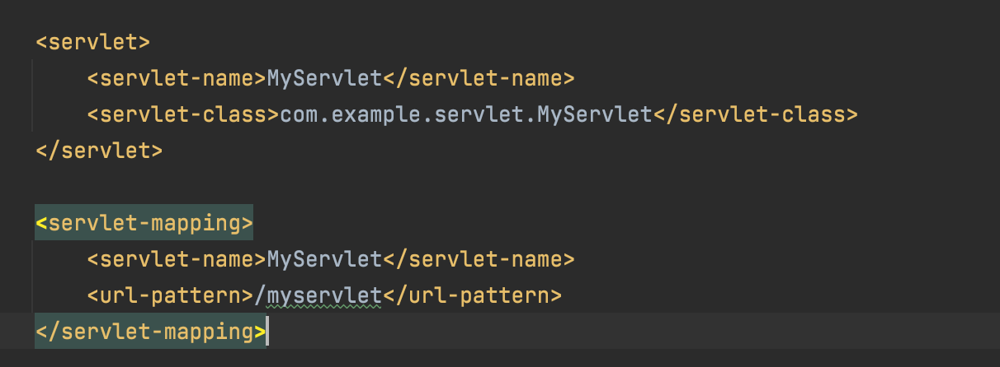

# Bug修复记录

 <br></br>

+ ##### <font color=teal>【已解决】</font> Mac IDEA 中无法运行web项目Tomcat报错Error13
   
   
   <br></br>
   >- terminal中输入
   >```linux
   >% chmod -R 777 tomcat文件夹路径
   >```
   <br></br>
---

+ ##### <font color=teal>【已解决】</font>项目启动后没有out文件夹
  
    <br></br>
  >生成的文件夹叫target，和out一样的，可以在project structure->module->path中看

  <br></br>
   
---  
+ ##### <font color=teal>【已解决】</font>无法自动靠localhost：8080跳转到index，404报错
    <br></br>
   Tomcat Run Configuration-Deployment中的path改成/
   <br></br>
---
+ ##### <font color=teal>【已解决】</font>在web.xml中写完servlet和servlet-mapping标签，
   ##### 访问localhost：8080/myservlet，404报错
   
<br></br>
Tomcat Run Configuration-Deployment中的path改成/
<br></br>
---

+ ##### <font color=teal>【已解决】</font>用注解同样，访问localhost：8080/myservlet，404报错

<br></br>

Tomcat Run Configuration-Deployment中的path改成/

<br></br>

---